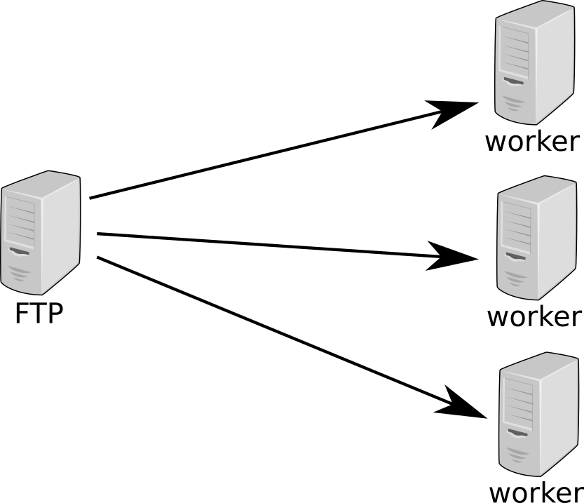
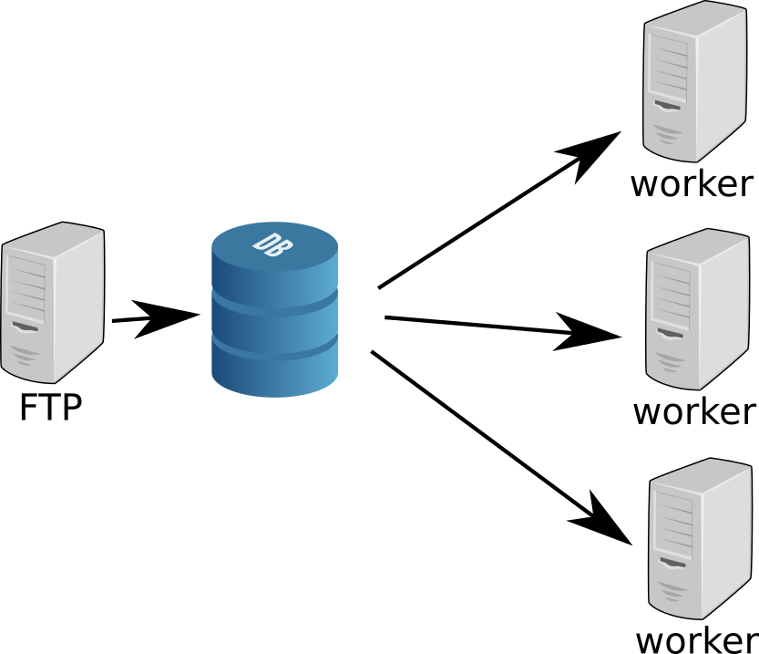
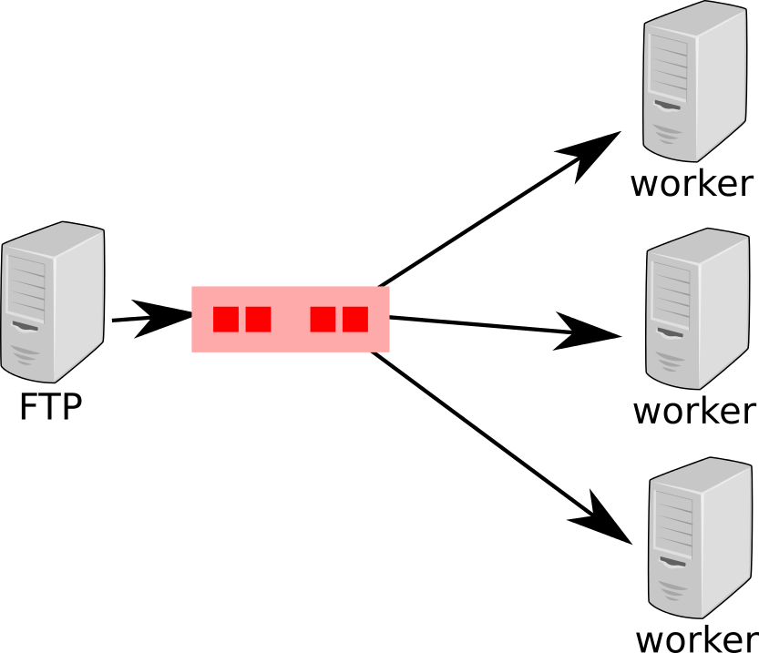

.. AMQP slides file, created by
   hieroglyph-quickstart on Sat Sep 17 12:48:18 2016.

============================
 Rapide présentaion de AMQP
============================

Pourquoi
========

 * propager un message, une information, un évenement ou un ordre à travers un SI

   illustration avec EDD

Approche SGBD SQL
=================

Solution champ avec un état

.. code-block:: sql

  CREATE TABLE message(id_message SERIAL,
                       content TEXT,
		       new BOOLEAN default 't');

Code
====
pull avec :

.. code-block:: sql

 UPDATE message SET new = 'f' WHERE new = 't' RETURNING content ;

ou pire :

.. code-block:: sql

 UPDATE message SET new = 'f' WHERE new = 't' RETURNING content LIMIT 1;

Problèmes
=========

 * manque de performance,
 * manque de scalabilité,
 * quid de 10, 20, 50 slaves ?
 * quid de différents types de message, type de subscriber ?

Solution ?
==========

Une file de message !

Quelle file de message ?
========================
 * redis
 * rq
 * mqtt
 * xmpp
 * amqp

AMQP
====

 * définition

   **Advanced Message Queuing Protocol**

 * urls

   - http://www.amqp.org/
   - https://fr.wikipedia.org/wiki/Advanced_Message_Queuing_Protocol

 * standard OASIS

Protocole
=========

 * but
 * protocole binaire
 * TLS intégré

Quelques Dates
==============

Exchange et Queue
=================

Exchange
========

Queue
=====

Routing Key
===========

Type d'exchange
===============

 * direct
 * fanout
 * topic
 * header

Direct
======

Fanout
======

Topic
=====
 * joker `*` et `#`

Header
======

Autres notions
==============

 * connetion
 * channel
 * priority

Example de code python
======================
 * pika

RabbitMQ
========

 * url
 * licence
 * limites et pieges
 * autre aspects
 * cluster

personnal e-branding
====================

 * twitter
 * github
